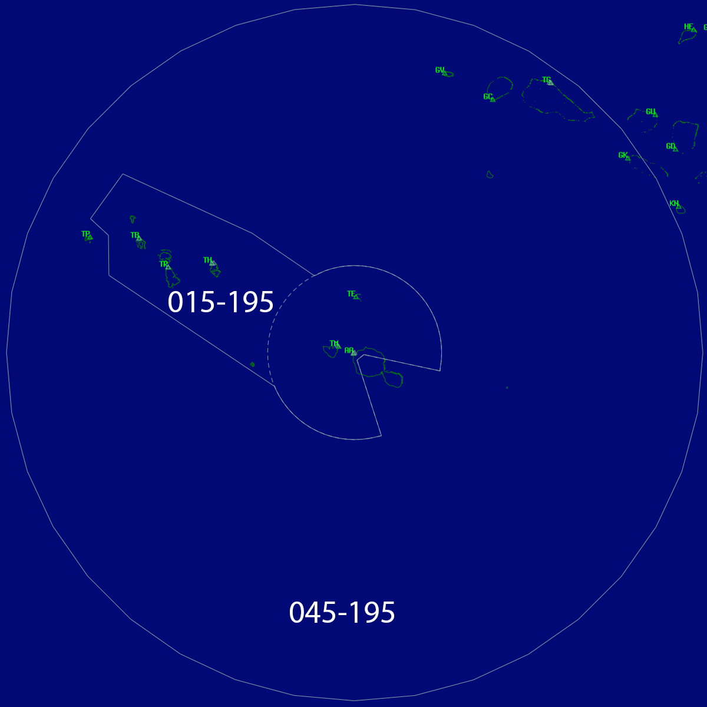

--8<-- "./includes/abbreviations.md"

## Positions

| Sector Name    | Shortcode | Callsign       | Frequency | Login ID |
| -------------- | --------- | -------------- | --------- | -------- |
| Tahiti Control | TAH       | Tahiti Control | 134.700   | NTTC_CTR |

## Airspace

TAH covers all airspace within 200 NM of the `TAF VOR` below `FL195`, excluding the TAHITI TMA 1 and 2 (Class D) below `FL195` where a radar service is provided by A-TAH.

TAH provides a radar enroute/approach service within the ILES SOUS LEVNT TMA (Class D) above `A015`. Otherwise TAH provides a procedural service above `FL045` (Class E). 

When A-TAH is offline TAH automatically inherits and assumes all responsibility for that sector.

<figure markdown> 
  
  <figcaption>
  The outer-most ring is the 200nm ring. Inside of this, the Class E service is provided by NTTC_CTR - outside it is provided by NTTT_FSS.
  </figcaption>
</figure>

## Sector Responsibilities

TAH manages the arrivals and departures into and out of any controlled or uncontrolled IFR aerodromes in its sector. This shall include issuing STARs and providing a top-down service where appropriate.

## Coordination

### NTTT

TAH shall give NTTT a **10 minute warning** of an aircrafts crossing of the airspace boundary.

### A-TAH

TAH shall issue STARs to aircraft bound for NTAA and NTTM.